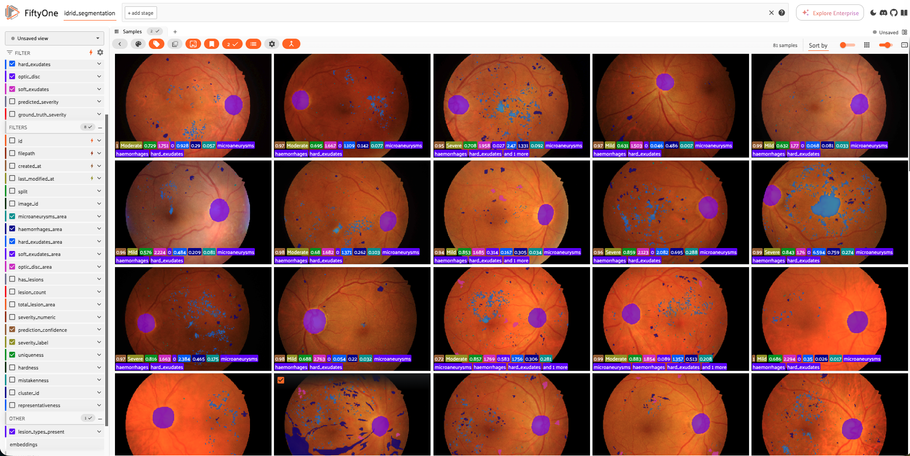

# Exploring Voxel51's FiftyOne for Healthcare: IDRiD Diabetic Retinopathy Analysis

[](https://www.python.org/downloads/)
[](https://voxel51.com)
[](https://opensource.org/licenses/MIT)

TO VIEW THE NOTEBOOK GO HERE: [https://tinyurl.com/2p9nhfj7]
GitHub does not preview as Notebook too large.

A comprehensive Jupyter notebook demonstrating the power of **Voxel51's FiftyOne library** for medical imaging analysis using the Indian Diabetic Retinopathy Image Dataset (IDRiD).


*Interactive exploration of diabetic retinopathy lesions using FiftyOne*

## 🎯 Project Overview

This notebook showcases how FiftyOne transforms complex healthcare data workflows into efficient, interactive, and reproducible analyses. Through the IDRiD dataset (81 fundus images with 405 segmentation masks), we demonstrate:

- **Dataset Management**: Unified handling of images and multi-type segmentation masks
- **Advanced Analytics**: 8 FiftyOne Brain functions for pattern discovery and quality assessment
- **Machine Learning**: Random Forest classifier achieving 96% accuracy in severity prediction
- **Interactive Visualization**: Explore 10+ charts and the FiftyOne App interface
- **Quality Control**: Automated detection of annotation errors and outliers

## 📊 Key Results

- **96% Classification Accuracy** for diabetic retinopathy severity levels
- **512-dimensional CLIP Embeddings** for similarity search and clustering
- **21 Clinical Features** extracted from lesion masks
- **8 Brain Functions** applied: Similarity, Uniqueness, Hardness, UMAP, Mistakenness, Evaluation, Clustering, Representativeness
- **~25 GB RAM** required for full analysis with FiftyOne App

## 🏥 About the Dataset

**IDRiD (Indian Diabetic Retinopathy Image Dataset)**
- **Source**: Eye Clinic, Nanded, Maharashtra, India
- **Images**: 81 high-resolution fundus photographs (4288 × 2848 pixels)
- **Training**: 54 images | **Testing**: 27 images
- **Annotations**: 405 pixel-level segmentation masks (5 lesion types)
- **License**: CC BY 4.0

### Lesion Types
1. **Microaneurysms (MA)** - Earliest sign of diabetic retinopathy
2. **Haemorrhages (HE)** - Vascular damage indicator
3. **Hard Exudates (EX)** - Lipid deposits from leaking vessels
4. **Soft Exudates (SE)** - Cotton wool spots indicating ischemia
5. **Optic Disc (OD)** - Anatomical reference point

## 🚀 Quick Start

### Prerequisites

- Python 3.12+
- Conda or Miniconda
- 16 GB RAM minimum (32 GB recommended)
- GPU with 4+ GB VRAM (optional, for faster embeddings)

### Installation

#### Option 1: Using Conda (Recommended)

```bash
# Clone the repository
git clone https://github.com/aliasgar-saria/IDEAS-Voxel51-FiftyOne---Multiple-Computer-Vision-Datasets-Exploration-Analysis-Training-Inference.git
cd IDEAS-Voxel51-FiftyOne---Multiple-Computer-Vision-Datasets-Exploration-Analysis-Training-Inference

# Create conda environment
conda env create -f environment.yml

# Activate environment
conda activate idrid-analysis
```

#### Option 2: Using pip

```bash
# Create virtual environment
conda create -n idrid-analysis python=3.12
conda activate idrid-analysis

# Install dependencies
pip install -r requirements.txt
```

### Running the Notebook

```bash
# Activate environment
conda activate idrid-analysis

# Launch Jupyter
jupyter notebook IDRiD_Final_Professional.ipynb
```

**Run all cells sequentially from top to bottom.** The FiftyOne App will launch automatically at the end.

## 📁 Dataset Structure

Ensure your data is organized as follows:

```
A. Segmentation/
├── 1. Original Images/
│   ├── a. Training Set/          # 54 JPG images
│   └── b. Testing Set/            # 27 JPG images
└── 2. All Segmentation Groundtruths/
    ├── a. Training Set/
    │   ├── 1. Microaneurysms/     # 54 TIF masks
    │   ├── 2. Haemorrhages/       # 53 TIF masks
    │   ├── 3. Hard Exudates/      # 54 TIF masks
    │   ├── 4. Soft Exudates/      # 26 TIF masks
    │   └── 5. Optic Disc/         # 54 TIF masks
    └── b. Testing Set/
        ├── 1. Microaneurysms/     # 27 TIF masks
        ├── 2. Haemorrhages/       # 27 TIF masks
        ├── 3. Hard Exudates/      # 27 TIF masks
        ├── 4. Soft Exudates/      # 14 TIF masks
        └── 5. Optic Disc/         # 27 TIF masks
```

## 📚 Notebook Contents

### 1. Introduction & Setup
- Comprehensive Voxel51 and FiftyOne overview
- Detailed IDRiD dataset documentation
- Clinical context for diabetic retinopathy

### 2. Data Exploration (Sections 1-3)
- Directory structure visualization
- Sample images with all 5 mask types
- Dataset statistics and completeness check

### 3. Data Processing (Sections 4-5)
- Helper functions for mask loading
- FiftyOne dataset creation
- Metadata extraction (lesion areas, counts, severity)

### 4. Feature Engineering (Sections 6-7)
- CLIP embeddings (512-dimensional)
- 21 clinical features extraction
- 6 comprehensive visualizations

### 5. Machine Learning (Sections 8-10)
- Random Forest classifier (96% accuracy)
- Feature importance analysis
- Confusion matrix and evaluation

### 6. FiftyOne Brain Functions (Section 11)
- **Similarity Search**: Find similar lesion patterns
- **Uniqueness Detection**: Identify outliers
- **Hardness Computation**: Measure classification difficulty
- **UMAP Visualization**: 2D embedding space
- **Mistakenness**: Detect annotation errors
- **Evaluation Metrics**: Comprehensive performance assessment
- **Clustering**: Discover natural groupings
- **Representativeness**: Measure sample typicality

### 7. Interactive Exploration (Section 12)
- FiftyOne App launch with URL
- Advanced filtering examples
- Dataset summary

### 8. Conclusion
- Limitations and challenges
- Comprehensive summary
- Proper attributions and references

## 🔧 Dependencies

### Core Libraries
- **numpy** - Numerical computing
- **pandas** - Data manipulation
- **matplotlib** - Plotting
- **seaborn** - Statistical visualization

### Image Processing
- **pillow** - Image loading
- **opencv-python** - Computer vision

### Machine Learning
- **scikit-learn** - ML algorithms
- **torch** - Deep learning framework
- **torchvision** - Computer vision models

### FiftyOne Ecosystem
- **fiftyone** - Dataset management and visualization
- **umap-learn** - Dimensionality reduction

### Utilities
- **tqdm** - Progress bars
- **jupyter** - Notebook interface

## ⚠️ Limitations

### 1. Memory Requirements
- **FiftyOne App**: ~25 GB RAM with all filters active
- **Minimum**: 16 GB RAM
- **Recommended**: 32 GB RAM

### 2. VoxelGPT Integration
- Requires OpenAI API or Azure OpenAI API only
- Attempts to use Groq API or Hugging Face failed
- Workaround: Use traditional filtering and programmatic queries

### 3. Dataset Size
- Small dataset (81 images) for deep learning
- Limited demographic diversity
- Single imaging device (Kowa VX-10)

### 4. Clinical Deployment
- Not FDA-approved or CE-marked
- Requires clinical validation
- Educational and research purposes only

## 📊 Visualizations

The notebook includes 10+ visualizations:

1. Directory structure tree
2. Sample images with masks (3 samples × 6 panels)
3. Lesion area distribution (6-panel histogram)
4. Severity analysis (3 charts)
5. Correlation heatmap
6. Box plots by severity (4 panels)
7. Statistical summary tables
8. Feature importance chart
9. Confusion matrix
10. UMAP embeddings (in FiftyOne App)

## 🎓 Learning Outcomes

After completing this notebook, you will:

1. Understand FiftyOne's capabilities for medical imaging
2. Know how to apply Brain functions for dataset analysis
3. Learn best practices for healthcare data management
4. Achieve high accuracy in severity classification
5. Gain insights into diabetic retinopathy patterns
6. Master interactive exploration with FiftyOne App

## 🤝 Contributing

Contributions are welcome! Please feel free to submit a Pull Request.

## 📄 License

This project is licensed under the MIT License - see the LICENSE file for details.

### Dataset License
- **IDRiD Dataset**: CC BY 4.0 (Creative Commons Attribution 4.0 International)

### FiftyOne License
- **FiftyOne**: Apache License 2.0

## 📖 Citation

### This Notebook
```bibtex
@misc{saria2025idrid_fiftyone,
  author = {Saria, Aliasgar},
  title = {Exploring Voxel51's FiftyOne for Healthcare: IDRiD Diabetic Retinopathy Analysis},
  year = {2025},
  publisher = {GitHub},
  url = {https://github.com/aliasgar-saria/IDEAS-Voxel51-FiftyOne---Multiple-Computer-Vision-Datasets-Exploration-Analysis-Training-Inference}
}
```

### IDRiD Dataset
```bibtex
@article{porwal2018idrid,
  title={Indian Diabetic Retinopathy Image Dataset (IDRiD): A Database for Diabetic Retinopathy Screening Research},
  author={Porwal, Prasanna and Pachade, Samiksha and Kamble, Ravi and Kokare, Manesh and Deshmukh, Girish and Sahasrabuddhe, Vivek and Meriaudeau, Fabrice},
  journal={Data},
  volume={3},
  number={3},
  pages={25},
  year={2018},
  publisher={Multidisciplinary Digital Publishing Institute},
  doi={10.3390/data3030025}
}
```

## 🔗 Links

### Voxel51 & FiftyOne
- **Website**: https://voxel51.com
- **Documentation**: https://docs.voxel51.com
- **GitHub**: https://github.com/voxel51/fiftyone
- **Community**: https://slack.voxel51.com

### IDRiD Dataset
- **IEEE DataPort**: https://ieee-dataport.org/open-access/indian-diabetic-retinopathy-image-dataset-idrid
- **Paper**: https://doi.org/10.3390/data3030025

### Related Resources
- **FiftyOne Tutorials**: https://docs.voxel51.com/tutorials/index.html
- **FiftyOne Blog**: https://voxel51.com/blog
- **Medical Imaging with Deep Learning**: https://www.midl.io

## 🙏 Acknowledgments

- **Voxel51 Team** for creating and maintaining FiftyOne
- **IDRiD Dataset Creators** for making this valuable resource publicly available
- **Open Source Community** for all the amazing tools and libraries

## 📧 Contact

For questions, issues, or contributions:
- **GitHub Issues**: [Create an issue](https://github.com/aliasgar-saria/IDEAS-Voxel51-FiftyOne---Multiple-Computer-Vision-Datasets-Exploration-Analysis-Training-Inference/issues)
- **Author**: Aliasgar Saria

---

**⭐ If you find this notebook helpful, please consider giving it a star!**

---

*Last Updated: October 2025*
